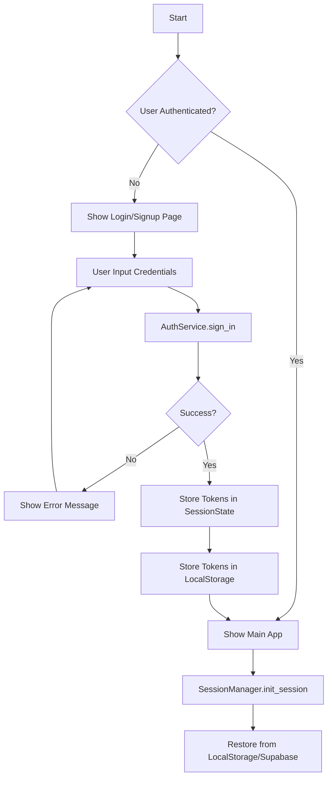
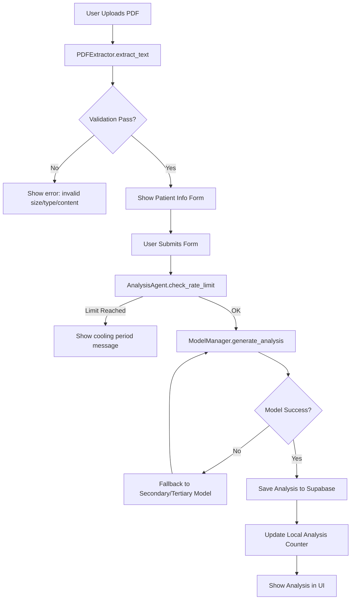
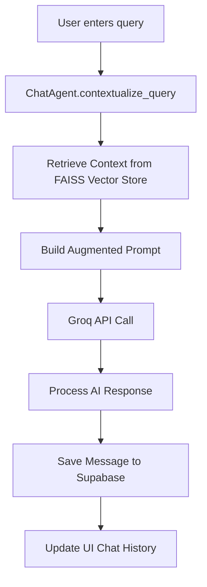

# Report Analyzer: Comprehensive Technical Documentation

## 1. Project Overview
**Report Analyzer** is an AI-powered personal health insights agent. It allows users to upload medical blood reports in PDF format, performs a detailed AI analysis of the results, and provides a RAG-based (Retrieval-Augmented Generation) chat interface for follow-up questions.

### Key Features
- **Secure Authentication**: Integration with Supabase Auth.
- **Persistent Sessions**: Local storage and Supabase-backed session management.
- **PDF Extraction**: Automated text extraction from medical PDFs using `pdfplumber`.
- **Intelligent Analysis**: Multi-tier model hierarchy (Groq/Llama) for robust health insights.
- **Interactive Chat**: RAG-powered chatbot that understands the context of the analyzed report.
- **Rate Limiting**: Daily analysis limits to manage resource consumption.

---

## 2. System Architecture

The application is built using a modern stack focused on speed and reliability:
- **Frontend**: Streamlit (Python-based interactive web framework).
- **Backend/Auth**: Supabase (PostgreSQL, Auth, Storage).
- **AI Engine**: Groq (High-speed LLM inference).
- **Embeddings/Search**: FAISS (Facebook AI Similarity Search) + HuggingFace Embeddings for RAG.
- **PDF Processing**: `pdfplumber`.

---

## 3. Flow Diagrams

### 3.1 Authentication Flow
This diagram shows how users sign up, log in, and how sessions are restored.

### 3.2 Report Analysis Flow
This diagram illustrates the journey from PDF upload to the final AI report.

### 3.3 Chat & RAG Flow
How the assistant answers questions using document context.

---

## 4. Component Breakdown

### 4.1 Authentication Layer
- **`AuthService`**: The core interface for Supabase Auth. It handles password-based sign-in, account creation, session restoration, and "resend confirmation" logic.
- **`SessionManager`**: Manages the Streamlit session state and synchronizes it with the browser's `localStorage` via JavaScript injection, ensuring users stay logged in across refreshes.

### 4.2 AI & Logic Layer
- **`AnalysisAgent`**: Coordinates the report analysis. It implements **In-Context Learning** by storing snippets of previous analyses in a local knowledge base to improve the consistency of future reports.
- **`ModelManager`**: A robust model routing system. It uses a tiered approach (Primary -> Secondary -> Tertiary -> Fallback) to handle Groq API rate limits or model failures gracefully.
- **`ChatAgent`**: Implements the RAG pipeline. It chunks the extracted PDF text, generates embeddings using `all-MiniLM-L6-v2`, and stores them in a FAISS vector store for semantic search during chat.

### 4.3 Data Utilities
- **`PDFExtractor`**: Specifically tuned for medical reports. It uses `pdfplumber` to pull text and includes a verification step to ensure the document contains relevant medical terminology.
- **`Validators`**: Strict checks for password strength, email format, and document validity.

---

## 5. Detailed Data Flow

1. **Extraction**: `pdfplumber` processes the raw bytes of a PDF.
2. **Contextualization**: The system takes patient metadata (age, name, gender) and merges it with the extracted text.
3. **Analysis**: The prompt is sent to `Llama 3.3 70B` (or fallback). The response is structured to be empathetic yet clinical.
4. **Persistence**: Every message and analysis is saved to the `chat_messages` table in Supabase, linked by a `session_id`.
5. **Retrieval**: When chatting, the **Contextualization Step** reformulates the user's question into a standalone query to ensure the FAISS search is accurate even for ambiguous questions like "How about my hemoglobin?".

---

*This documentation is intended for developers and maintainers of the Report Analyzer project.*
